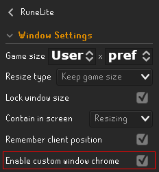
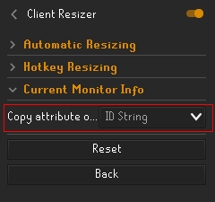
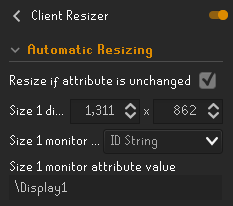
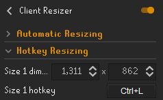
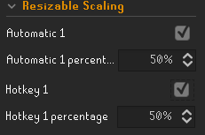
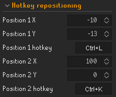

# Client Resizer
Also annoyed by having to change your client's size (game size), resizable scaling, or position every time you move RuneLite to a different monitor or when doing a different activity? Or are you a big fan of contain in screen? 

**Client Resizer allows for automatic or hotkey-based resizing of the client. It also allows for changing the resizable scaling, and containing your client in screen (snapping back).** It's especially useful for people that have multiple monitors of different sizes or resolutions, or for people that like to resize or (re)position their client in specific scenarios (e.g. per activity). 

**This plugin adds the following features:**
- Automatically resize your client when it's moved to a different monitor. This can be configured per monitor attribute, e.g. per ID string (differs for every monitor), resolution (dimension) or refresh rate.
- Hotkey-based resizing. Set a hotkey (e.g. Ctrl+L) and resize the client to a size of your choosing.
- Resize your client when switching RL config profiles if this isn't done by the config profiles themselves yet. Set up automatic resizing for your monitors with different game sizes per RL config profile. Then enable ``Resize when switching RuneLite config profile``.
- Change your resizable scaling (stretched mode plugin), either automatically or hotkey-based.
- (Re)position your client using hotkeys. This allows you to e.g. get RL flush with your screen or position it in a specific position per activity. Furthermore, this allows you to position the client in ways the normal Windows window manager does not allow, e.g. that the title bar is offscreen at the top of the screen.
- Contain the client in screen: the client will snap back after moving it using shift + Windows + arrow key or after your cursor leaves the menubar (title bar). This can either be 'soft' or 'hard' contain in screen. Offsets can be added if the client is not in your preferred location after snapping back.

The plugin still respects all the other settings in the ``RuneLite`` > ``Window Settings`` config. For that reason, I personally suggest using the following RuneLite Window Settings: 
 
*It is recommended to **enable** ``Enable custom window chrome`` in ``RuneLite`` > ``Window Settings`` if you'd like to automatically resize the client or contain the client in screen when dragging it to a different monitor. Shift + Windows key + arrow or hotkey-based repositioning does still automatically resize the client with custom chrome disabled. However, moving the client to a different monitor by dragging the title bar will not work with custom chrome disabled regarding automatically resizing the client or properly containing the client in the screen. 
I generally also recommend locking the window size so you don't accidentally use Windows's snap resize function.*

## User Instructions / How to set up

### Automatic resizing
- Move the client to the monitor for which you'd like to set up automatic resizing.
- Open the config panel of Client Resizer (gear icon).
- Select one of the attribute types from the dropdown menu ``Copy attribute of current monitor``. 
E.g. ID String: 
 

  - ID String: unique ID per monitor.
  - Bounds: x, y, width, height of the monitor.
  - Dimensions: width, height of the monitor in pixels (resolution).
  - Refresh Rate: refresh rate of the monitor.
- Open the ``Automatic Resizing`` category.
- Set the client / game size in one of the dimension options.
- Set the corresponding dropdown menu to the attribute type you previously selected.
- Paste (Ctrl+V on Windows) the value of the attribute in the corresponding ``monitor attribute value`` box. 
E.g. a fully configured monitor looks like this: 

If you also want to resize your client when loading a different RuneLite config profile, then enable the ``Resize when switching RuneLite config profile`` option. If you don't understand what this means, you should probably leave this option disabled (default).
Note: the client will resize when your cursor leaves the menubar (title bar).

### Hotkey-based resizing
- Open the config panel of Client Resizer (gear icon).
- Open the ``Hotkey Resizing`` category.
- Set the client / game size in one of the dimension options.
- Set the corresponding hotkey. Combinations such as Ctrl + L are allowed. 

### Resizable scaling (stretched mode)
*Note: Requires the stretched mode plugin to be enabled to have any effect ingame!*
- Configure automatic resizing or hotkey-based resizing per the instructions above.
- Open the config panel of Client Resizer (gear icon).
- Open the ``Resizable Scaling`` category.
- Tick the box you want to change resizable scaling for.
- Enter the resizable scaling percentage. 

### Hotkey based positioning
- Open the config panel of Client Resizer (gear icon).
- Open the ``Position`` category.
- Set the ``Position X`` and ``Position Y``.
- Set the corresponding hotkey. Combinations such as Ctrl + L are allowed. 
 
*Tip: you can enable the ``Copy client position`` button to copy the current client position and post it to e.g. notepad.*

### Contain in screen (snapping back)
TODO: README STILL NEEDS TO BE ADDED FOR THIS
- Added a (hacky) option to contain the client in screen: the client will snap back after moving it using shift + Windows + arrow key or after your cursor leaves the menubar (title bar). This can either be 'soft' or 'hard' contain in screen. Offsets can be added if the client is not in your preferred location. Please note that custom chrome needs to be enabled to properly snap the client back to the right position if you are moving the client by dragging the menubar (title bar).

## Additional info
Not tested on macOS or Linux; results may vary.

If you experience any issues or have any concerns, please reach out to YvesW via a GitHub Issue, by Discord direct messaging or via the RuneLite Discord by mentioning @``YvesW``.

## Changelog
01-2024:
- Fixed automatic resizing after the flatlaf changes. Please note that it is still recommended to have custom chrome enabled! The client will resize when your cursor leaves the menubar (title bar), if it's on the menubar.
- Added the option to change the position/location of the client using hotkeys. Thanks to Hooder for the tip!
- Added a (hacky) option to contain the client in screen: the client will snap back after moving it using shift + Windows + arrow key or after your cursor leaves the menubar (title bar). This can either be 'soft' or 'hard' contain in screen. Offsets can be added if the client is not in your preferred location. Please note that custom chrome needs to be enabled to properly snap the client back to the right position if you are moving the client by dragging the menubar (title bar).

09-2023:
- Added the option to also change ``Resizable Scaling`` from the stretched mode plugin when using automatic or hotkey-based resizing.

02-2023:
- Fixed the icon not being displayed.
- Added the option to automatically resize the client when changing the RuneLite config profile if the current monitor matches one of the configured monitor attributes.