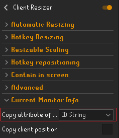
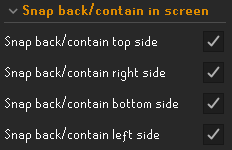
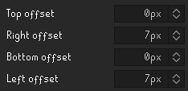
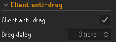

# Client Resizer
Also annoyed by having to change your client's size (game size), resizable scaling, or position every time you move RuneLite to a different monitor or when doing a different activity? Or are you a big fan of snap back/contain in screen, or client anti-drag? 

**Client Resizer allows for automatic or hotkey-based resizing and repositioning of the client. It also allows for changing the resizable scaling, for containing your client in screen (snapping back), and for client anti-drag.** It's especially useful for people that have multiple monitors of different sizes or resolutions, or for people that like to resize or (re)position their client in specific scenarios (e.g. per activity). 

**This plugin adds the following features:**
- Automatically resize your client when it's moved to a different monitor. This can be configured per monitor attribute, e.g. per ID string (differs for every monitor), resolution (dimension) or refresh rate.
- Hotkey-based resizing. Set a hotkey (e.g. Ctrl+L) and resize the client to a size of your choosing.
- Resize your client when switching RL config profiles if this isn't done by the config profiles themselves yet. Set up automatic resizing for your monitors with different game sizes per RL config profile. Then enable ``Resize when switching RuneLite config profile``.
- Change your resizable scaling (stretched mode plugin), either automatically or hotkey-based.
- (Re)position your client using hotkeys. This allows you to e.g. get RL flush with your screen or position it in a specific position per activity. Furthermore, this allows you to position the client in ways the normal Windows window manager does not allow, e.g. in a way that the title bar is offscreen at the top of the screen.
- Snap back/Contain the client in screen: the client will snap back **after your cursor leaves the menubar (title bar)** or after moving it using shift + Windows + arrow key. This can either be 'soft' or 'hard' snap back/contain in screen. Offsets can be added if the client is not in your preferred location after snapping back.
- Client anti-drag: the client will snap back if you do not drag the menubar (title bar) for long enough. This can be useful to prevent moving the client unintentionally.

The plugin still respects all the other settings in the ``RuneLite`` > ``Window Settings`` config. For that reason, I personally suggest using the following RuneLite Window Settings: 
 
*It is recommended to **enable** ``Enable custom window chrome`` in ``RuneLite`` > ``Window Settings`` if you'd like to automatically resize the client or snap it back (contain the client in screen) when dragging it to a different monitor. Shift + Windows key + arrow or hotkey-based repositioning does still automatically resize the client with custom chrome disabled. However, moving the client to a different monitor by dragging the title bar will not work with custom chrome disabled when trying to automatically resize the client or properly snap the client back (contain in screen). 
I generally also recommend **locking the window size**, so you don't accidentally use Windows's snap resize function. The plugin is compatible with an unlocked window size though by using a workaround.*

## User Instructions / How to set up

### Automatic resizing
- Move the client to the monitor for which you'd like to set up automatic resizing.
- Open the config panel of Client Resizer (gear icon).
- Select one of the attribute types from the dropdown menu ``Copy attribute of current monitor``. 
E.g. ID String: 
 

  - ID String: unique ID per monitor.
  - Bounds: x, y, width, height of the monitor.
  - Dimensions: width, height of the monitor in pixels (resolution).
  - Refresh Rate: refresh rate of the monitor.
- Open the ``Automatic Resizing`` category.
- Set the client / game size in one of the dimension options.
- Set the corresponding dropdown menu to the attribute type you previously selected.
- Paste (Ctrl+V on Windows) the value of the attribute in the corresponding ``monitor attribute value`` box. 
E.g. a fully configured monitor looks like this: 

If you also want to resize your client when loading a different RuneLite config profile, then enable the ``Resize when switching RuneLite config profile`` option. If you don't understand what this means, you should probably leave this option disabled (default).
Note: the client will resize when your cursor leaves the menubar (title bar).

### Hotkey-based resizing
- Open the config panel of Client Resizer (gear icon).
- Open the ``Hotkey Resizing`` category.
- Set the client / game size in one of the dimension options.
- Set the corresponding hotkey. Combinations such as Ctrl + L are allowed. 

### Resizable scaling (stretched mode)
*Note: Requires the stretched mode plugin to be enabled to have any effect ingame!*
- Configure automatic resizing or hotkey-based resizing per the instructions above.
- Open the config panel of Client Resizer (gear icon).
- Open the ``Resizable Scaling`` category.
- Tick the box you want to change resizable scaling for.
- Enter the resizable scaling percentage. 

### Hotkey-based positioning
- Open the config panel of Client Resizer (gear icon).
- Open the ``Position`` category.
- Set the ``Position X`` and ``Position Y``.
- Set the corresponding hotkey. Combinations such as Ctrl + L are allowed. 
 
*Tip: you can enable the ``Copy client position`` button to copy the current client position and post it to e.g. notepad.* 
*Tip 2: this will override snap back/contain in screen, thus allowing you to move your client to another monitor if desired.*

### Snapping back (contain in screen)
Note that it is more snapping the client back to the edge of the screen than containing in the screen. This does allow for some cool options though like 'soft' snapping back/containing in screen, i.e. only snapping back when the user drags the client a bit over the screen edge. This allows the user to still drag the client to another screen if desired. 
It is recommended to **enable** ``Enable custom window chrome`` in ``RuneLite`` > ``Window Settings`` to properly snap the client back/contain it in screen when dragging it to a different monitor. Shift + Windows key + arrow or hotkey-based repositioning does still automatically resize the client with custom chrome disabled. 
Furthermore, it is recommended to **lock the window size** in the ``RuneLite`` config, so you don't accidentally use Windows's snap resize function. 
To set it up:
- Open the config panel of Client Resizer (gear icon).
- Open the ``Snap back/contain in screen`` category.
- Tick the boxes for the sides you want to enable snap back/contain in screen for. 
   
- The client will now be snapped back/contained in screen once your cursor leaves the menubar (title bar). 
  *Tip: even with a 'hard' snap back/contain in screen, you can use hotkey-based resizing to move your client to another monitor if desired.*
- *Optional:* if your client is not in the desired location after snapping back or snaps back too soon/too late, increase or decrease the offset. 
   
- *Optional:* if you would like to use a 'soft' snap back/contain, which allows you to drag your client to another monitor but snaps your client back to the screen's edge if you put it barely over the edge, then lower the amount of ``Snap back pixels`` to e.g. 100. This way you can still snap your client to the edge of the screen, but also move your client to another screen if desired. 
  If you like your client to always be snapped back/contained in screen, keep this at a very high value (e.g. 100000).
   

### Client anti-drag
*Note: Requires ``Enable custom window chrome`` in ``RuneLite`` > ``Window Settings`` to be enabled!*
- Open the config panel of Client Resizer (gear icon).
- Open the ``Client anti-drag`` category.
- Enable the ``Client anti-drag`` setting.
- Enter the ``drag delay`` you prefer. This is how long the cursor will have to not move while in the title bar/menu bar (read: how long you need to drag for) for anti-drag to not engage. 
  

### Importing and exporting settings
You can export and import your config to/from the clipboard to easily transfer your config settings to e.g. a different profile without having to duplicate the profile. Please keep in mind that **importing will overwrite your config settings**! 
- Type the ``::ClientResizerExport`` command ingame to copy the config to your clipboard.
- Type the ``::ClientResizerImportOverwrite`` command ingame to import the config from your clipboard. Keep in mind that **importing will overwrite your config values**.

## Additional info
Not tested on macOS or Linux; results may vary.

If you experience any issues or have any concerns, please reach out to YvesW via a GitHub Issue, by Discord direct messaging or via the RuneLite Discord by mentioning @``YvesW``.

## Changelog
04-2024:
- Added ``Client anti-drag``.

03-2024:
- Added a workaround that allows for resizing of the client after the user has manually adjusted the client size by dragging the edges of the client. The setting will be enabled or disabled automatically based on the ``Lock window size`` setting in the ``RuneLite`` config.

02-2024:
- Disabled numerical hotkeys (0-9, no modifiers) while entering the bank pin by default. A config option has been added in case the user wants to re-enable this setting.
- Added ``::ClientResizerExport`` and ``::ClientResizerImportOverwrite`` commands to export and import your config to/from your clipboard. Keep in mind that importing will overwrite your config values. 

01-2024:
- Fixed automatic resizing after the flatlaf changes. Please note that it is still recommended to have custom chrome enabled! The client will resize when your cursor leaves the menubar (title bar).
- Added the option to change the position/location of the client using hotkeys. Thanks to Hooder for the tips!
- Added an option to snap the client back: the client will snap back after moving it using shift + Windows + arrow key or after your cursor leaves the menubar (title bar). This can either be 'soft' or 'hard' snap back/contain in screen. Offsets can be added if the client is not in your preferred location. Please note that custom chrome needs to be enabled to properly snap the client back to the right position if you are moving the client by dragging the menubar (title bar).

09-2023:
- Added the option to also change ``Resizable Scaling`` from the stretched mode plugin when using automatic or hotkey-based resizing.

02-2023:
- Fixed the icon not being displayed.
- Added the option to automatically resize the client when changing the RuneLite config profile if the current monitor matches one of the configured monitor attributes.